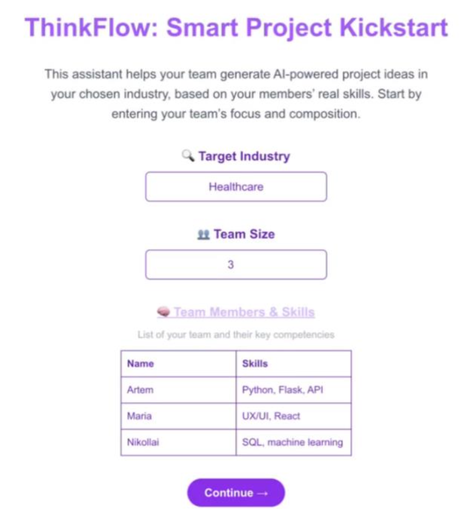
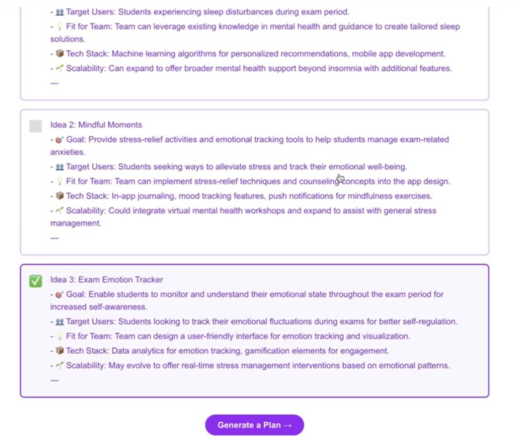
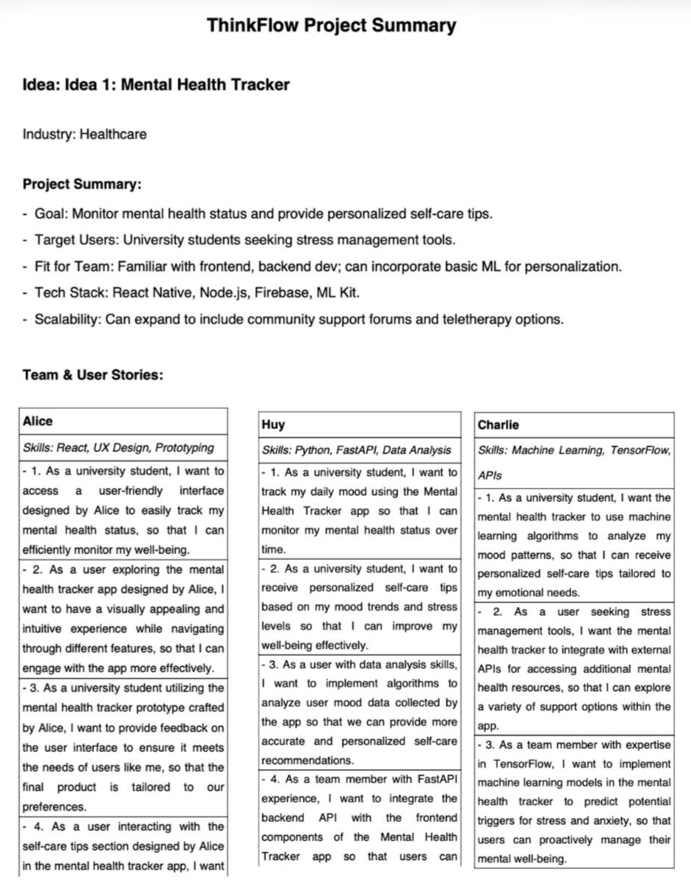

# ThinkFlow AI (Whiteboard + FastAPI)

ThinkFlow AI is a lightweight **AI-assisted ideation and planning whiteboard** for early-stage Agile project initiation.  
It guides a team through a structured brainstorming canvas (Pain Points, Ideas, Goals, Constraints), uses an LLM to generate candidate project concepts, then exports a **submission-ready project summary PDF**.

This repository contains:
- **Frontend:** Next.js (React) web app
- **Backend:** FastAPI service that orchestrates prompts + PDF generation

---

## Local setup

### 1) Backend (FastAPI)

```bash
cd backend
python -m venv .venv
source .venv/bin/activate
pip install -r requirements.txt
```

---

## What problem it solves

Early project planning often gets stuck in messy brainstorm notes that never turn into actionable artifacts.  
ThinkFlow AI converts early brainstorming inputs into:
- short, comparable idea proposals
- a structured one-page **project brief PDF** suitable for pitching / reporting / onboarding

---

## User flow (4 steps)

1) **Welcome / Team Setup**  
Collects industry + team composition (names + skills). Used to contextualize idea generation.



2) **Brainstorming Whiteboard (Quadrants)**  
Users fill sticky-note style inputs in four zones:
- Pain Points / Needs
- Ideas / Features
- Goals / Outcomes
- Constraints / Resources


3) **AI-generated idea selection**  
Backend produces ~3 candidate project ideas derived from the quadrant inputs. User selects the best option.



4) **Export**  
The selected idea + team details are compiled into a downloadable PDF.



---

## System architecture (high-level)

Frontend (Next.js) handles the UI and step navigation.  
Backend (FastAPI) exposes endpoints for:
- generating contextual tags/hashtags based on skills
- generating ideas from quadrant inputs
- generating and serving a PDF artifact

---

## Backend API (key endpoints)

| Step | Method | Endpoint | Purpose |
|------|--------|----------|---------|
| 1 | POST | `/generate-hashtags` | Generate contextual hashtags from skills |
| 2 | POST | `/generate-ideas` | Generate 3 tailored project ideas from quadrants |
| 3 | POST | `/generate-pdf` | Generate a structured one-page project PDF |
| 4 | GET  | `/download-pdf` | Download the latest generated PDF |

---

## Tech stack

- Frontend: Next.js + React + TypeScript
- Backend: FastAPI (Python)
- AI: OpenAI GPT model (via API)
- Document generation: server-side PDF generation

